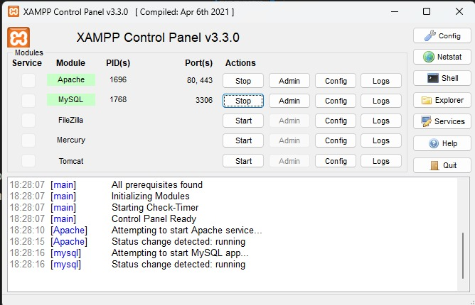

# Evaluación Final Integradora 2023.
Trabajo integral de practica profesionalizante I Pyhton - DevOps.
## Tabla de contenidos
- [Entorno Virtual e Inicio Local](#entorno-Virtual-e-Inicio-Local)
- [Variables de entorno](#variables-de-entorno)
- [Proyecto en Docker](#proyecto-en-docker)
- [Integrantes](#integrantes)

## *Entorno Virtual e Inicio Local*
***
**Paso 1.**

Crear entorno virtual de python:

* Linux

```
python3 -m venv venv
```

* Windows

```
py -3 -m venv .venv
```


El segundo *venv* es el nombre del entorno (Se puede poner otro nombre).

**Paso 2.**

Activar entorno virtual.

* Linux
```
source venv/bin/activate
```
* Windows (GitBash)
```
source venv/Scripts/activate
```

**Paso 3.**

Inciar Apache y MySql en XAMPP para trabajar proyecto en localhost.



**Paso 4.**

Dentro del entorno, levantar el archivo requirements.txt que contiene las dependencias necesarias para poder trabajar.

```
pip install -r requirements.txt
```

**Paso 5.**
Eliminar carpeta migraciones e iniciar el modelo de migraciones

```python 
flask db init
```
Esto se hace por unica vez y crea todas las carpetas necesarias para trabajar.

**Paso 6.**

Generar migracion que cargue en la base de datos las tablas creadas.

```python 
flask db migrate -m "Descripcion de migracion"
```
Realizado esto, se actualiza para que aparezca.
```python 
flask db upgrade
```

**Paso 7.**

Ver contenido sobre [Variables de entorno](#variables-de-entorno) y luego iniciar proyecto local con:
```
flask run --reload
```
## *Variables de entorno*

En archivo ".env.example" se encuentran las varibles de entorno necesarias para usar el proyecto en forma local o desde docker. Usar en archivo ".env" aquellas que se requieran.

## *Proyecto en Docker*

**Nota:** Comandos para uso en Linux. En caso de requerirse permisos, se debe anteponer "sudo" antes de cada comando.

**Paso 1.**

Crear imagen en Docker-Compose, si es la primera vez que ingresa al proyecto.
```
docker-compose build
```

**Paso 2.**

Correr la imagen y levantar el contenedor. 
```
docker-compose up -d
```

**Paso 3.**

Abrir el navegador en el puerto indicado para el proyecto Flask.


### *Comandos utiles*

Ver contenedores abiertos
```
docker ps
```


Ver contenedores frenados
```
docker ps -a
```

Ver imagenes
```
docker images
```
Detener contenedor
```
docker container stop (nro container)
```
Detener contenedor en compose
```
docker-compose stop
```

Eliminar contenedor
```
docker container rm (nro container)
```
Ingresar a contenedor y manejarlo desde la shell
```
docker exec -it (nro container) sh
```

## *Integrantes*

* Irazoqui, Marcos - m.irazoqui@itecriocuarto.org.ar
* Martinez, Joaquin - jo.martinez@itecriocuarto.org.ar
